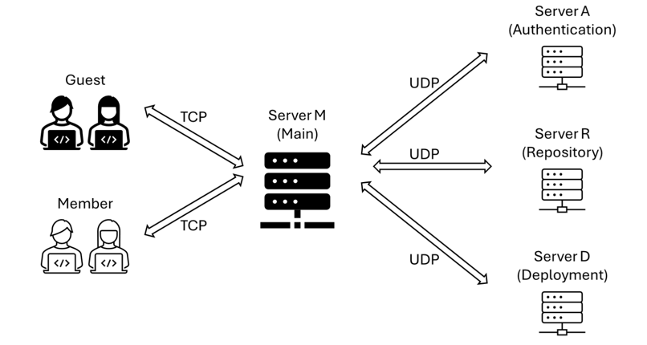

# Git450 v0.2
## Introduction

The Socket Programming Project of EE450, 2024 Fall, University of Southern California. Professor: [Ali Zahid](https://viterbi.usc.edu/directory/faculty/Zahid/Ali).

**The original ideas and high-level design of this project come from the requirements document provided by the professor.**

This project implements a Git-like project version control system using **C++11** and UNIX socket libraries, running on a command-line interface (e.g. `zsh` or `bash`).

## Features

- **Distributed System**: The project is divided into four servers: **ServerA** (Authentication Server), **ServerD**
  (Deployment Server), **ServerR** (Repo Server), and **ServerM** (Main Server).

- **Custom Protocol**: A custom protocol is designed for the communication between the client and the servers.

- **Encapsulated Socket Classes**: Two classes, `TCPSocket` and `UDPSocket`, are implemented to simplify the socket
  programming.

## Files

- include/
  - `git450protocol.h`: provides the protocol for the Git450 application.
  - `config.h`: provides some configuration parameters for the project.
  - `udp_socket.h`: provides a minimal **UDP socket class** for simplifying the socket programming.
  - `tcp_socket.h`: provides a minimal **TCP socket class** for simplifying the socket programming.
  - `utils.h`: provides some utility functions like `split` and `join`.
  - `logger.h`: provides a simple logger for `log` command.
  - `encryptor.h`: provides a encryptor for the project.
- data/
  - `members.txt`: stores the members' credentials.
  - `filenames.txt`: stores the files of each user in the **repository**.
  - `deployed.txt`: stores the deployed files in the **deployment server**.
  - `log.txt`: stores the logs of the users.
### Source Files
- `serverM.cpp`: The main program for the ServerM (Main Server).
- `serverA.cpp`: The main program for the ServerA (Authentication Server).
- `serverD.cpp`: The main program for the ServerD (Deployment Server).
- `serverR.cpp`: The main program for the ServerR (Repo Server).
- `client.cpp`: The main program for the client.
- `makefile`: The Makefile for the project.

## Runtime Environment
- OS: Ubuntu 20.04
- Compiler: g++ 9.3.0 or higher
- C++ Standard: **C++14** or higher
- Make: GNU Make 4.2.1 or higher

## How to Run
1. Prepare a Ubuntu 20.04 environment.
    - You can install docker according to [USC CSCI-104 Docker Tutorial](https://github.com/csci104/docker) to run the
      project.
    - *Might also* work on macOS or other Linux distributions, but not guaranteed.
2. Make sure you have installed the required tools.
    ```shell
    sudo apt update
    sudo apt install g++ make
    ```
3. Clone the project
    ```shell
   git clone
   cd git450
   ```
4. Compile the project
    ```shell
    make
    ```
5. For locally testing, you can run the servers and the client in different terminals.
    - Terminal 1 - 4: Run the servers
        ```shell
        ./serverA
        ```
        ```shell
        ./serverD
        ```
        ```shell
        ./serverR
        ```
        ```shell
        ./serverM
        ```
    - Terminal 5: Run the client
        ```shell
        ./client <username> <password>
        ```
      For test, you can use `test` and `test` as the username and password.

## Implementation

### Network Topology



### Git450 Application-Layer Protocol

A Git450 protocol is designed to facilitate the communication between the client and the server.
It runs between the client and the server, and between the servers. **NOT** in user's command lines. User commands are
parsed and translated into Git450 protocol by the client, and the server processes the Git450 protocol and returns the
result to the client.

The protocol is designed as follows:

```plaintext
[username] [operation] [payload]
```

- username: the username of the client.
- operation (client): one of the following:
  - auth: Authentication (sent automatically on client startup).
  - lookup <username>: List files of a user.
  - push <filename>: Upload a file to the repo.
  - remove <filename>: Delete a file from the repo.
  - deploy: Deploy repo files to the server.
  - log: Retrieve user logs.
- operation (server): same as above with each operation suffixed with `_result`.
- payload: the payload (or the data) of the operation.

Example:

1. Client sends an authentication request to ServerM over TCP
    ```plaintext
    user1 auth password1
    ```
2. ServerM transfers the authentication request to ServerA over UDP
    ```plaintext
    user1 auth password1
    ```
3. ServerA responds to ServerM over UDP
    ```plaintext
    user1 auth_result MEMBER
    ```
4. ServerM transfers the authentication result to the client over TCP
    ```plaintext
    user1 auth_result MEMBER
    ```
   
Another example:

1. Client sends a lookup request to ServerM over TCP
    ```plaintext
    user1 lookup user2
    ```
2. ServerM transfers the lookup request to ServerR over UDP
    ```plaintext
    user1 lookup user2
    ```
3. ServerR responds to ServerM over UDP
    ```plaintext
    user1 lookup_result file1 file2 file3
    ```
4. ServerM transfers the lookup result to the client over TCP
    ```plaintext
    user1 lookup_result file1 file2 file3
   ```

### Transport-Layer Protocol

**TCP** is used for client-server communication.

**UDP** is used for server-server communication.

Both TCP and UDP are used in **non-persistent** mode, meaning that the server and client/server will close the
connection after each request/response.

Especially for TCP, the client and server handshake each time before a request.


### TCP/UDP Socket Classes

To simplify the socket programming, I implemented two classes, `TCPSocket` and `UDPSocket`, which encapsulate the socket
programming details.

See `include/tcp_socket.h` and `include/udp_socket.h` for more details.

## Future Work

1. Apply multi-threading to the server to handle multiple clients simultaneously (current version is single-threaded,
   and a second client must wait for the first client to finish its operation with server).
2. Improve the data store mechanism: currently, the data is stored in **file system**, which is volatile, and is hard to
   support multi-threading.
   It should be stored in a persistent storage like a **database**.

## References

The sample data in the `data/` folder and the network topology (including the graph above) are provided by the professor and the TA group of EE450, 2024 fall, University of Southern California.

## Acknowledgement

Thanks to Professor [Ali Zahid](https://viterbi.usc.edu/directory/faculty/Zahid/Ali) and TAs for the guidance and
support in my cruise at EE450.

Thanks to the following resources and tools:

- [Computer Networking: A Top-Down Approach](https://www.amazon.com/Computer-Networking-Top-Down-Approach-7th/dp/0133594149)
- [Beej's Guide to Network Programming](https://beej.us/guide/bgnet/html/)
- [C++11 Reference](https://en.cppreference.com/w/cpp/11)
- [GitHub Copilot](https://copilot.github.com/)

Thanks to the verse that inspired me not to give up the gracious 15 points when endlessly tackling the fancy bugs and
the beautiful Segmentation Faults:
> Isaiah 40:31 *But those who hope in the Lord will renew their strength. They will soar on wings like eagles; they will run and not grow weary, they will walk and not be faint.*
